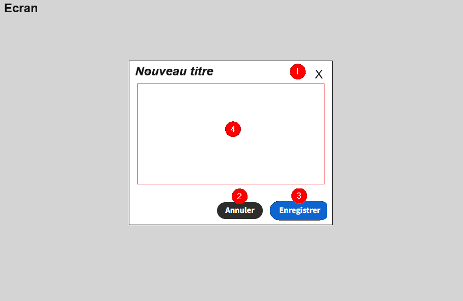

# Jtamodal

# Description

Ce composant permet d'afficher (de superposer) un container au centre de l'écran.

<p></p>

1 - Le clic sur l'icône "Fermer" déclenche le Onclick correspondant (Voir settings)

2 - Le clic sur Le bouton "Annuler" déclenche le Onclick correspondant (Voir settings)

3 - Le clic sur le bouton "Ok" déclenche le Onclick correspondant (Voir settings)

4 - Vous pouvez mettre ce que vous voulez dans la zone de travail (scrollable verticalement). **NB** : On peut faire disparaitre le footer (voir settings). La zone de travail occupera alors la totalité du container.

# Utilisation

Vous ferez apparaitre et disparaitre ce container avec une condition associée à ce composant (Par exemple, la présence d'un state fera apparaitre le container. On supprimera le state dans le onclick pour faire disparaitre le container)

**NB** : Ne pas oublier de déclarer un background color pour pouvoir masquer le contenu de l'écran qui se trouvera sous le container


## Instructions

To build your new  plugin run the following in your Budibase CLI:
```
budi plugins --build
```

You can also re-build everytime you make a change to your plugin with the command:
```
budi plugins --watch
```

Find out more about [Budibase](https://github.com/Budibase/budibase).
